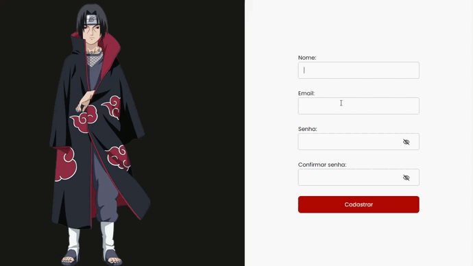

<h1 align="center">
  Form-validation
</h1>

<p align="center">
 

  
</p>

## Tecnologias

Esse projeto foi desenvolvido com as seguintes tecnologias:

- ReactJS
- Sass
- Typescript
- Yup
- Formik
- Vite

</br>

### Como rodar o projeto

```bash
# Clone este repositório
$ git clone <https://github.com/Maria-Eduarda90/form-validation>

# Acesse a pasta do projeto no terminal/cmd
$ cd form-validation

# Instale as dependências
$ yarn

# Execute a aplicação em modo de desenvolvimento
$ yarn dev

```

</br>

<h1 align="center">
  
</h1>